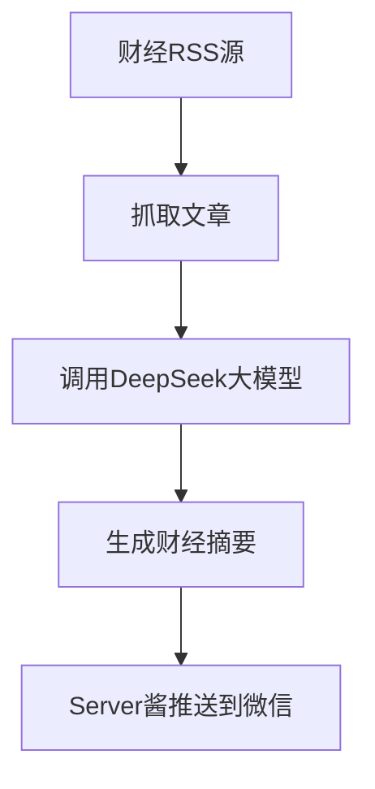

# 📈 FinNewsCollectionBot · 每日财经速递

**为专业投资者打造的智能财经资讯助手**

[](https://github.com/sgrsun3/FinNewsCollectionBot/actions/workflows/rss-bot.yml)


---
## 🧧 支持作者 · 让项目持续进化！

如果本项目对你有帮助，欢迎打赏支持，资助我多喝几杯咖啡 ☕，跑更多模型 💻～

<div align="center">
  
</div>

- 💬 微信号：`ArkhamKni9ht`
- 🙌 感谢每一位 Star、Fork 和支持者！

> ✨ 金融爸爸一块钱我不嫌少，一百块我也不嫌多 😊
---

## 🎯 项目简介

FinNewsCollectionBot 是一款为券商分析师、基金经理、研究员等专业投资人量身打造的**财经资讯智能摘要助手**。

它自动聚合主流财经媒体的 RSS 信息源，并调用 **DeepSeek 大语言模型**，每天两次推送核心财经摘要，帮助你快速掌握全球市场动态、产业趋势与政策走向。

---

## 🚀 核心功能

- ⏰ **每日两次自动摘要推送**  
  每天上午 09:00、下午 17:00 定时运行，生成分析报告

- 🌐 **多源财经 RSS 聚合**  
  支持华尔街见闻、36氪、东方财富、华尔街日报、BBC 等主流财经媒体

- 🧠 **大模型深度分析**  
  使用 DeepSeek 大语言模型自动提炼财经新闻的核心内容与趋势判断

- 📲 **微信即时推送**  
  集成 Server 酱服务，生成的财经摘要自动推送至你的微信

---

## 🧑‍💻 技术栈

- Python
- feedparser + newspaper3k
- DeepSeek 大语言模型 API
- GitHub Actions 自动定时部署

---

## 🔧 快速开始（快速部署）

1. **Fork 本项目**
2. 配置你的 RSS 源地址和 DeepSeek API Key
3. 在 GitHub 中设置 Secrets：
   ```bash
   OPENAI_API_KEY=your_deepseek_api_key
   SERVER_CHAN_KEYS=your_serverchan_key
   ```
4. 自动触发 GitHub Actions 开始运行

📌 成功部署后，每天两次财经摘要将自动生成并推送到你的微信！

---

## 💼 使用场景

- 券商/基金公司/研究所自动生成投资快报
- 金融从业者日常资讯监测
- 个人投资者快捷了解宏观政策/产业热点
- 财经内容运营/财经公众号 AI 辅助创作

---

## 📌 示例流程图



---

## 🛠️ 后续规划

- ✅ 增加更多 RSS 财经数据源
- ✅ 引入情绪分析与金融事件检测
- ⏳ 支持多语言财经摘要生成
- ⏳ 构建简洁前端页面用于非技术用户管理配置

---

## 🤝 欢迎参与

📬 欢迎 Star ⭐ / Fork 🍴 / PR 💡 本项目，一起共建更智能的财经决策工具。

你也可以通过 Issues 留言建议功能，或私信我交流使用体验～

---

© 2024 sgrsun3 | MIT License
